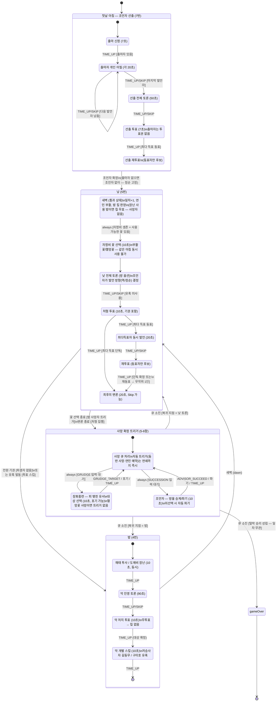

# 게임 상태 머신 (FSM) — 상태 전이 다이어그램

> 구현: `server/src/game/machine.ts` (XState v5) + `server/src/game/logic.ts` (순수 전이 로직)
> 근거: `docs/requirements.md` 4번(밤)·5번(낮)·7번(조언자 출마)·8번(승리 조건)
>
> 타이머·소켓은 아직 연결되지 않았다. 시간 만료는 외부에서 `TIME_UP` 이벤트로 주입되며,
> 각 상태의 제한시간 값은 `shared/src/config/gameConfig.ts`(TIMER_CONFIG)를 따른다.

## 전체 흐름

## 사망 확정 트리거 처리 순서 (사망자 1인 기준)

1. **COMPANION** (자동) — 저승사자: 지정해 둔 길동무 동반 사망 → 사망 큐에 연쇄 적재
2. **GRUDGE** (입력) — 장화홍련: 피 맺힌 유서 1인 지목 동반 사망. 멸망꽃 사망 시 기회 자체 없음
3. **SUCCESSION** (입력) — 조언자: 방울 승계 지목 / 파기. 10초 미선택 시 자동 파기
4. **KKACHI_REVIVAL** (자동) — 까치선비: 바리공주 생존 시 연민 부활 예약 (원인 불문).
   다음 새벽에 부활하며 진영이 **중립**으로 전환. 소모한 1회성 스킬은 복구되지 않음

연쇄 예시: 저승사자 처형 → 길동무(장화홍련) 동반 사망 → 장화홍련 유서 발동 가능(동반 사망은 봉인 원인이 아님) → 유서 대상도 사망 큐에 적재되어 같은 절차로 처리.

## 설계상 가정 / 미결 사항 (구현 시 주석으로도 표기)

| 항목 | 현재 구현 | 근거 |
|---|---|---|
| 첫날(1일차)의 진행 | 조언자 선출 직후 **낮 토론부터** 시작 (꽃 단계 없음 — 이전 밤이 없으므로) | 문서에 명시 없음 — 가정 |
| 출마자 없음 | 조언자 없이 진행, 발언 순서 정순 고정 | 문서에 명시 없음 — 가정 |
| 선출 투표 무득표 | 출마자 중 무작위 선정 | 문서에 명시 없음 — 가정 |
| 악 처치 투표 동률 | 최다득표자 중 무작위 | 문서 미정 — 가정 |
| 밤 사망자의 트리거 시점 | 자청비 꽃 단계 **이후** 처리 (부활꽃으로 살아나면 트리거 미발동) | 문서에 명시 없음 — 가정 |
| 길동무 지정 지속 | 재지정 전까지 유지, 저승사자 사망 시 소모 | 문서에 명시 없음 — 가정 |
| 동시 전멸 | 선 진영 승리 | 문서 미정 — 가정 |
| 투항(30초 팀 동의)·P버튼 | 미구현 — 소켓 연동 세션에서 이벤트로 추가 예정 | 6번 섹션 |
| 도깨비 장난 밤의 악 투표 | 투표는 그대로 진행, 차단 사실 비공개 (아침 "사망자 없음") | PROGRESS 확정 사항 반영 |
| 중립 승리 | 악 전멸(=선 승리) 시점에 중립 1인 이상 생존 시 함께 승리 — 전이에는 영향 없음, 결과 표시에서 처리 | PROGRESS 확정 사항 반영 |
