# 게임 상태 머신 (FSM) — 상태 전이 다이어그램

> 구현: `server/src/game/machine.ts` (XState v5) + `server/src/game/logic.ts` (순수 전이 로직)
> 타이머: `server/src/game/timer.ts` (PhaseTimer) + `server/src/game/session.ts` (GameSession — 머신·타이머 결합)
> 근거: `docs/requirements.md` 1번(방 옵션·Skip)·2번(타이머)·4번(밤)·5번(낮)·7번(조언자 출마)·8번(승리 조건)
>
> **서버 권위 타이머**: GameSession이 상태 전이를 구독하다가 시간 제한이 있는 상태에 들어오면
> `TIMER_CONFIG`(또는 방 옵션 `RoomTimerSettings`) 기준으로 타이머를 시작하고, 만료 시 머신에
> `TIME_UP`을 자동 발행한다. 클라이언트에는 `SOCKET_EVENTS.timerSync`(`TimerSyncPayload`)로
> 남은 시간을 동기화한다 (UI·룸 연동은 이후 세션).

## 전체 흐름

```mermaid
stateDiagram-v2
    [*] --> setup
    setup: 시작 분기 (통과 상태)
    setup --> firstMorning: 9인 모드
    setup --> day: 7인 모드 [조언자 뽑기 제외\n발언 순서 정순 고정]

    state "첫날 아침 — 조언자 선출 (7번)" as firstMorning {
        [*] --> candidacy
        candidacy: 출마 신청 (7초)
        appeal: 출마자 개인 어필 (각 20초)\nSkip = 발언자 본인만
        electionDiscussion: 선출 전체 토론 (50초)\n생존자 전원 Skip 시 조기 종료
        electionVote: 선출 투표 (7초)\n출마자는 투표권 없음
        electionRevote: 선출 재투표\n(동표자만 후보)

        candidacy --> appeal: TIME_UP [출마자 있음]
        appeal --> appeal: TIME_UP/본인 SKIP [다음 발언자 남음]
        appeal --> electionDiscussion: TIME_UP/본인 SKIP [마지막 발언자]
        electionDiscussion --> electionVote: TIME_UP / 전원 SKIP
        electionVote --> electionRevote: TIME_UP [최다 득표 동표]
    }

    state "낮 (5번·7번)" as day {
        [*] --> personalSpeech
        personalSpeech: 개인 발언 (방 옵션 80/120초 × 인원)\n조언자는 마지막, Skip = 발언자 본인만
        discussion: 전체 토론 (방 옵션 3분/5분)\n생존자 전원 Skip 시 조기 종료
        vote: 처형 투표 (10초, 기권 포함)
        voteReveal: 투표 결과 공개 (5초)\n누가 누구에게 투표했는지 화살표로 공개\npostVoteTarget에 따라 분기
        tieSpeech: 최다득표자 동시 발언 (20초)
        revote: 재투표 (동표자만 후보)
        finalPlea: 최후의 변론 (20초)\nSkip = 처형 대상자 본인만 → 즉시 사망 처리

        personalSpeech --> personalSpeech: TIME_UP/본인 SKIP [다음 발언자 남음]
        personalSpeech --> discussion: TIME_UP/본인 SKIP [마지막 발언자]
        discussion --> vote: TIME_UP / 전원 SKIP [유혹 미사용]
        vote --> voteReveal: TIME_UP [항상 —\npostVoteTarget 기록]
        voteReveal --> tieSpeech: TIME_UP [최다 득표 동표]
        tieSpeech --> revote: TIME_UP
        voteReveal --> finalPlea: TIME_UP [최다 득표 단독]
        revote --> voteReveal: TIME_UP [단독 확정 또는\n재동표 → 무작위 1인]
    }

    state "밤 (4번)" as night {
        [*] --> evilDiscussion
        evilDiscussion: 악 진영 토론 (90초)\n악 생존자 전원 Skip 시 조기 종료
        evilVote: 악 처치 투표 (10초)\n무투표 → 킬 없음\n대상 확정(nightKillTargetId)
        evilSkills: 악 개별 스킬 (10초)\n저승사자 길동무 / 구미호 유혹
        goodSkills: 해태 투사 / 도깨비 장난 / 자청비 부활꽃·멸망꽃 (10초, 동시)\n자청비는 nightKillTargetId만 부활 후보\n(도깨비 보호 여부는 아직 모름) — 부활꽃/멸망꽃 동시 사용 불가\n조언자 발언 방향(역/정순) 결정 가능
        dawn: 새벽 (통과 상태)\n일차+1, 연민 부활\n밤 킬 판정(도깨비 보호 또는 자청비 부활꽃 성공 시 무효 — 둘 다 성공 시 둘 다 소모)

        evilDiscussion --> evilVote: TIME_UP / 악 전원 SKIP
        evilVote --> evilSkills: TIME_UP (대상 확정)
        evilSkills --> goodSkills: TIME_UP
        goodSkills --> dawn: TIME_UP
        dawn --> [*]: always
    }

    state "사망 확정 트리거 (5-6항)" as resolveDeaths {
        [*] --> advance
        advance: 사망 큐 처리\n자동 트리거(동반 사망·연민 예약)는 연쇄까지 즉시
        awaitGrudge: 장화홍련 — 피 맺힌 유서\n대상 선택 (10초, 포기 가능)\n멸망꽃 사망이면 트리거 없음
        awaitSuccession: 조언자 — 방울 승계/파기 (10초)\n미선택 시 자동 파기

        advance --> awaitGrudge: always [GRUDGE 입력 대기]
        advance --> awaitSuccession: always [SUCCESSION 입력 대기]
        awaitGrudge --> advance: GRUDGE_TARGET / 포기 / TIME_UP
        awaitSuccession --> advance: ADVISOR_SUCCEED / 파기 / TIME_UP
    }

    firstMorning --> day: 조언자 확정\n(출마자 없으면 조언자 없이 — 정순 고정)
    day --> night: voteReveal 종료 [희생자 없음]\n또는 유혹 발동 [투표 스킵 — voteReveal 안 거침]
    day --> resolveDeaths: 변론 종료/본인 Skip [처형 집행]
    night --> resolveDeaths: 새벽(dawn) 종료 [밤 사망자 트리거]
    resolveDeaths --> day: 큐 소진 [복귀 = 낮 개인 발언]
    resolveDeaths --> night: 큐 소진 [복귀 지점 = 밤]
    resolveDeaths --> gameOver: 큐 소진 [탈락 승리 성립 — 일차 무관]
    gameOver --> [*]
```

## 서버 권위 타이머 (2번 섹션 표 ↔ 상태 매핑)

`session.ts`의 `getTimerSpec()`이 상태 → `{ 페이즈 키, 제한시간 }` 매핑의 단일 원본이다.
페이즈 키가 바뀔 때만 타이머를 재시작하므로, 같은 페이즈 안의 이벤트(투표 등록·skip 집계)는
타이머에 영향을 주지 않고, 개인 발언은 발언자가 바뀔 때마다 새 타이머가 시작된다.

| 상태 | 제한시간 | 출처 |
|---|---|---|
| 출마 신청 / 선출 투표·재투표 | 7초 / 7초 | `TIMER_CONFIG.advisorCandidacy`·`advisorVote` |
| 출마자 어필 (발언자별) | 각 20초 | `advisorAppeal` |
| 선출 토론 | 50초 | `advisorDiscussion` |
| 개인 발언 (발언자별) | 80/120초 | 방 옵션 `RoomTimerSettings.personalSpeechSeconds` |
| 전체 토론 | 3분/5분 | 방 옵션 `RoomTimerSettings.discussionSeconds` |
| 처형 투표·재투표 / 악 처치 투표 | 10초 | `vote` |
| 처형 투표(재투표 포함) 결과 공개 — 끝나야 다음 단계로 진행 | 5초 | `voteReveal` |
| 동표 동시 발언 | 20초 | `tieSpeech` |
| 최후의 변론 | 20초 | `finalPlea` |
| 밤 선 진영 스킬(해태·도깨비·자청비 부활꽃/멸망꽃) / 악 개별 스킬 | 15초 / 10초 | `nightGoodSkillDecision`·`nightEvilIndividualSkill` |
| 악 토론 | 90초 | `nightEvilDiscussion` |
| 피 맺힌 유서 / 방울 승계 | 10초 / 10초 | `deathJanghwaDecision`·`deathAdvisorDecision` |
| dawn·advance(통과)·gameOver | 없음 | — |

## 사망 확정 트리거 처리 순서 (사망자 1인 기준)

1. **COMPANION** (자동) — 저승사자: 지정해 둔 길동무 동반 사망 → 사망 큐에 연쇄 적재
2. **GRUDGE** (입력) — 장화홍련: 피 맺힌 유서 1인 지목 동반 사망. 멸망꽃 사망 시 기회 자체 없음
3. **SUCCESSION** (입력) — 조언자: 방울 승계 지목 / 파기. 10초 미선택 시 자동 파기
4. **KKACHI_REVIVAL** (자동) — 까치선비: 바리공주 생존 시 연민 부활 예약 (원인 불문).
   다음 새벽에 부활하며 진영이 **중립**으로 전환. 소모한 1회성 스킬은 복구되지 않음

연쇄 예시: 저승사자 처형 → 길동무(장화홍련) 동반 사망 → 장화홍련 유서 발동 가능(동반 사망은 봉인 원인이 아님) → 유서 대상도 사망 큐에 적재되어 같은 절차로 처리.

## 설계상 가정 / 미결 사항 (구현 시 주석으로도 표기)

| 항목 | 현재 구현 | 근거 |
|---|---|---|
| 첫날(1일차)의 진행 | 밤 0(자청비 포함 goodSkills 전체 진행) 종료 후 조언자 선출(9인) 직후 **낮 개인 발언부터** 시작 | 문서에 명시 없음 — 가정 |
| 7인 모드 | 조언자 선출 없이 바로 첫날 낮, 발언 순서 정순 고정. 로스터는 깡철이·까치선비 제외 | 1번 섹션 확정 |
| 출마자 없음 | 조언자 없이 진행, 발언 순서 정순 고정 | 문서에 명시 없음 — 가정 |
| 선출 투표 무득표 | 출마자 중 무작위 선정 | 문서에 명시 없음 — 가정 |
| 악 처치 투표 동률 | 최다득표자 중 무작위 | 문서 미정 — 가정 |
| 밤 사망자의 트리거 시점 | goodSkills(자청비 포함) 시간 **이후**, dawn에서 처리 (부활꽃으로 살아나면 트리거 미발동) | 문서에 명시 없음 — 가정 |
| 조언자 발언 방향 결정 시점 | goodSkills 단계에서 ADVISOR_DIRECTION 이벤트로 (1일차는 정순 기본값) | 문서에 명시 없음 — 가정 |
| 동표 동시 발언(tieSpeech)의 Skip | 없음 (동시 발언이므로 TIME_UP만) | 문서에 명시 없음 — 가정 |
| 길동무 지정 지속 | 재지정 전까지 유지, 저승사자 사망 시 소모 | 문서에 명시 없음 — 가정 |
| 동시 전멸 | 선 진영 승리 | 문서 미정 — 가정 |
| 투항(30초 팀 동의) | 구현됨 — Room 레이어가 동의 집계 후 `TEAM_SURRENDER`로 게임 종료(상대 승리). 진행 상황은 같은 팀에게만 전송 | 6번 섹션 |
| P버튼(악 전용 즉시 사망+투표 스킵) | 미구현 — UI 세션에서 추가 예정 | 6번 섹션 |
| 도중에 나가기(전 진영 공용, FORFEIT) | 구현됨 — 어느 상태에서든 루트 `on: FORFEIT`으로 즉시 처리. 사망 트리거(길동무·유서)는 미발동, 조언자였다면 즉시 파기, 현재 페이즈는 유지(승리 조건 성립 시에만 즉시 `#gameOver`) | 6번 섹션(신규) |
| 도깨비 장난 밤의 악 투표 | 투표는 그대로 진행, 차단 사실 비공개 (아침 "사망자 없음") | 확정 반영 |
| 밤 사망의 공개 시점 | `night.dawn`~`resolveDeaths`(밤→낮 경로) 동안 `PublicGameState.players[].alive`는 밤 시작 시점 스냅샷으로 마스킹되어, 낮이 시작될 때까지 조기 노출되지 않음 | 4-c 피드백 |
| 중립 승리 | 악 전멸(=선 승리) 시점에 중립 1인 이상 생존 시 함께 승리 — 전이에는 영향 없음 | 확정 반영 |
